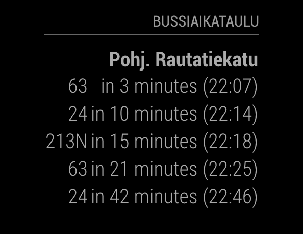

# Module for [MagicMirror](https://magicmirror.builders/): Timetable for HSL data (Finland)

The `mm-hsl-timetable` module fetches bus timetable data from HSL (Helsinki region, Finland) and shows the timetables for configured stops.

You will need to check the "solmutunnus" from https://www.avoindata.fi/data/fi/dataset/hsl-n-joukkoliikenteen-pysakit and add the number of the bus stop you want to show in the config stops-array. Or query the gtfsId from https://digitransit.fi/en/developers/apis/1-routing-api/stops/#query-stops-by-name-or-number.

## Screenshot

- HSL Timetable screenshot



## Using the module

1) Clone this repository under `MagicMirror/modules` folder
2) Add to the modules array in the `MagicMirror/config/config.js` file:
````javascript
modules: [{
	module: "mm-hsl-timetable",
	position: "top_right",
	header: "Bus schedule",
	config: {
		stops: [1130113],
		busCount: 5
	}
}]
````

## Configuration options

The following properties can be configured:


| Option                       | Description
| ---------------------------- | -----------
| `busCount`                   | Amount of busses to show/stop
| `stops`                 	   | The stop numbers to show as an array

Stops can also be an object with:

| Key                          | Description
| ---------------------------- | -----------
| `id`                         | Stop number
| `name`                 	   | Optional name to override one from API
| `minutesFrom`                | Minutes to skip from now (if the stop is not near)
